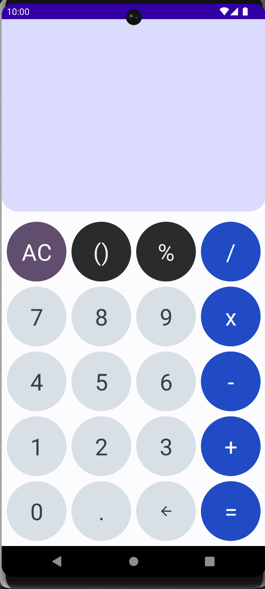
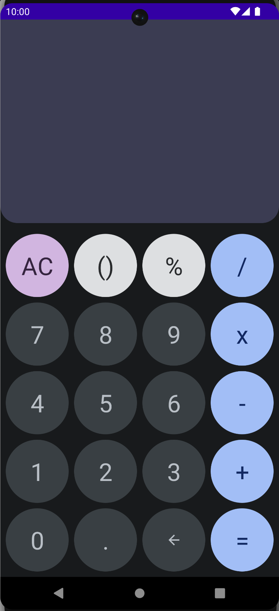

## Material3 Calculator (Google Pixel app copy)

The app was created to use JetpackCompose, setup bitrise workflows (develop, staging, main) with github pull requests.

#### What development process is setup?

- Github pull request;
- Bitrise
    - PR from any branch to `develop` (runs only unit tests)
    - PR from `develop` to `staging` (runs unit/instrumented tests)
    - PR from `staging` to `main` (deploy app to PlayMarket)

#### Light mode
[]

#### Dark mode
[]